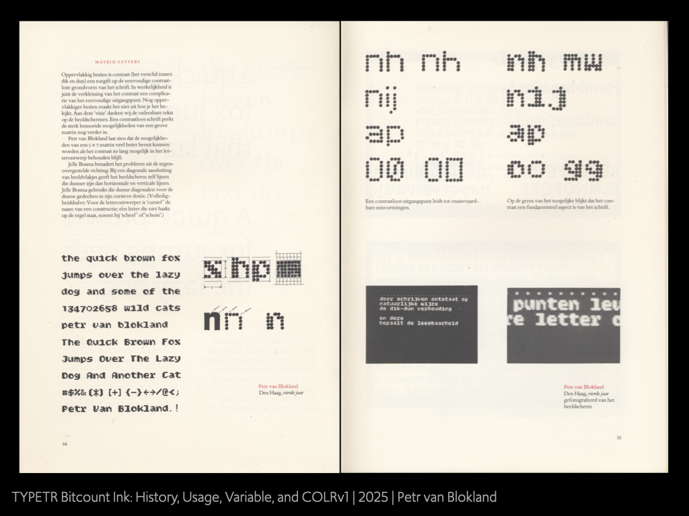
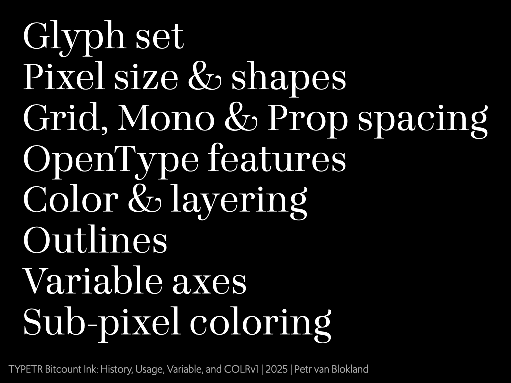
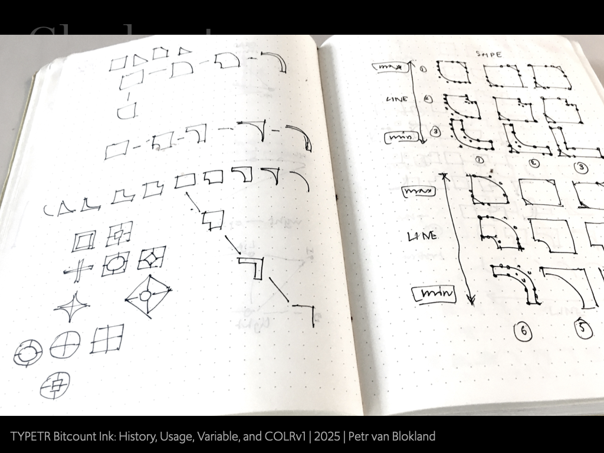

# Bitcount COLRv1

Slides from the TYPETR Bitcount presentation at the AypI conference 2025 in Copenhagen.

For now the movies in this presentation can be downloaded from https://we.tl/t-NopRCuSgGJ
These are large files, generated by Python script (not running in the browser). Let’s see what we do with these animations.

https://atypi.org/presentation/bitcount-ink-history-usage-variable-and-colrv1/

Bitcount (then called “fiveseven”) started from the misunderstanding in 1977 that 5x7 pixels was not enough to accommodate all glyphs for a lower case. If the x-height is 5 pixels, then the one remaining pixel for ascenders and descenders is too small. 

In those days pixel displays supported capitals and some basic characters of 6 pixels high. The 2 pixels for ascenders and descender in the lower case as solved by shifting the baseline and adjusting the x-height. 

Here a sample sheet from a company the made chips with pixel type hardwired in the chips. 

An article in the Lecturis “efi” publication from 1983 shows what happens if “contrast” is the last characteristic to be abandoned. Even ascenders and descenders of 1 pixel high are still readable in 2-pixel wide stems.

Keeping the contrast in small pixel sizes makes it easier to express the typical shape of specific letters.

Here the 5x7 Bitcount is used in a programming environment. 

Chapters from the ATypI 2025 Bitcount presentation. 

In order to expand the glyph to the full ascii range (including diacritics), contrast in stems still helps to visually separate the glyph from the diacritics. Not ideal, but still readable within the context of a text.

Once the grid is extended to 5x10 pixels, there is enough room for a full set of diacritics. Bitcount implements a large set. 

Where the “Grid” (5x7) and “Mono” (5x10) variants mono-spaced on 6 pixels wide, the “Prop” implements proportional spacing for many glyphs that more condensed or wider spacing. 

Later the Bitcount family was completed with a single-pixel stem weight. Of course this has some issues for the “Grid” variant, as described above, but for the “Mono” (5x10) variant there is enough room to separate the glyph shapes from the diacritics.

Many sketches were made to construct the shape of pixels. The aim to design the behavior of the inside and outside curves independently. This way circles, squares, diamonds, star and outlines can be generated from the same point structure. This resulted in a “Shape” axis that works as a sequential catalogue of pixel shapes. 

In addition, since each pixels is constructed from 4 quarters, they can be split into quadrants by a separate axis. 

Animated /a pixels (see also Bitcount-nnn.gif)

Grid, Mono & Prop spacing

Here an overview of the Bitcount style variants: “Grid” (5x7), “Mono” (5x10) and “Prop” (proportional x10). On top the “Double” stems and below the “Single” stems.

The supported OpenType features depend on the variants. E.g. extended ascenders and descenders are only available if there is enough vertical space to accommodate then. And the “Condensed” mode is only available in the “Single” variants. 

Some examples of the wide ranges of figures that is available. Not even that – within context — even fraction numbers can be created in a 2x4 pixel grid. At least all 0-9 have their own recognizable shape. 

Examples how the figure variants behave in currencies.

Variable standard black-pixel axes that define the pixel mask shape in COLRv1 usage:

* Pixel shape [ELSH]
* Weight (pixel size) [wght]
* Expanding quadrants [ELXP]
* Slant (shifting rows positions)[slnt]
* Cursive (replacing italic shapes) [CRSV]

COLRv1 is using the regular pixel shapes as mask for 2 “static” color layers. There is a “Foreground” image with partial transparant areas. And similarly there is a “Background” image, slightly different from the foreground.

The “Foreground” layer is guided by 3 independent axes:

* Size [SZP1]
* x-position [XPN1]
* y-position [YPN1]
	
And the “Background” also has 3 independent axes:

* Size [SZP2]
* x-position [XPN2]
* y-position [YPN2]
	
The total amount of axes in the Bitcount is 10, but since they are all independent from each other, we don’t need the same amount of master drawing that otherwise would have been necessary for a 10 dimensional design space.

Sub-pixel coloring axes

Typing /canvas shows the full Foreground and Background layers.

The element in the middle shows the selected pixel shape mask on top of the Foreground + Background

